# AI Native Game 项目总结

## 1. 项目概览

### 1.1 项目名称

`aiNativeGame-webdone`

### 1.2 项目定位

这是一个以《西游记》金蝉子十世轮回为灵感起点、融合中国志怪叙事与佛教轮回主题的 AI 原生叙事推理游戏原型。项目围绕"固定叙事骨架 + AI 动态生成内容 + 玩家调查与辩驳"展开，目标不是制作传统静态关卡，而是验证 AI 如何真正参与多世叙事组织、探索内容生成、物证推理构造与视觉资产生产的完整游戏流程。

- **叙事剧情设计**：项目以"九世轮回、逐世悟道"作为大主线，用单幕山村事件承载更长的宿命与觉悟主题，优点是既有可落地的局部悬疑体验，也保留了可持续扩展的长线叙事空间。
- **AI 方式**：项目不是让 AI 自由写故事，而是先由固定事件链、推理线和角色约束搭好骨架，再让 AI 在边界内动态生成场景、物品、线索、辩论内容与图像资源，优点是既保留变化性，又能保证逻辑稳定和可验证性。
- **落地实现**：项目通过前后端分层、工作流拆步、结构化输出校验、阶段式状态管理和图像缓存复用，把 AI 从"黑盒调用"落实为可调试、可扩展、可交互的原型系统，优点是后续无论扩剧情、扩玩法还是扩资源都更容易继续迭代。

### 1.3 项目形态

项目当前是一个可运行的单幕 Web 游戏原型，包含完整的前后端流程：

- 开场演出
- 场景探索
- 线索收集
- 辩论对质
- 结尾收束

### 1.4 关键词

AI 原生、动态叙事、调查推理、文字冒险、工作流生成、像素风资源生成、前后端联动

## 2. 项目题材与设计目标

本项目基于"白家村·第一世第一幕"的叙事框架展开。玩家扮演一名游方郎中，在一间发生过异变的空屋中醒来，通过观察病理征候、药理痕迹、打斗残留和特殊物件"残缺念珠"所触发的残念片段，逐步重建事件真相。

项目的设计目标主要有三点：

1. 用 AI 支撑一套可重复游玩的单幕叙事推理体验，而不是只展示一次性的固定脚本。
2. 让探索阶段与辩论阶段形成因果闭环，玩家在探索中获得的线索必须能在后续对质中真正发挥作用。
3. 让 AI 不只是负责文案生成，还参与场景、物品、线索、NPC 观点与视觉资源的生产，形成完整的 AI 原生内容流水线。

## 3. 世界观与内容设定

项目采用中式志怪悬疑氛围，故事背景设定在白虎岭下的白家村。村中爆发了被称为"白骨症"的异常病症，村民将灾祸归咎于山中的"白姑"，但真实情况并非如此简单。

项目内部为 AI 生成建立了统一的剧情骨架，明确限定了本幕的真实事件链，例如：

- 主角曾被请来诊病
- 患者在诊疗中突然发病
- 主角被袭昏迷
- 白姑曾进入现场并与病人发生冲突
- 死者死亡后，白姑带走了部分遗骨与物品
- 玩家在事后于空屋中醒来

这种做法保证了每次生成虽然细节不同，但故事核心不失控，仍然围绕同一幕的主题展开。

## 4. 核心玩法与流程结构

项目整体流程采用分阶段推进的结构，并且将 AI 生成请求分成两个阶段按需发起，以缩短每个阶段的等待时间：

### 4.1 开场阶段

玩家点击"开始游戏"后，前端立即向后端发起探索阶段所需资源的生成请求（探索工作流 + 场景图 + 物品图标），同时播放固定文本对话，建立"轮回感""指引者""白家村异事"等氛围，在叙事上完成玩家身份和情绪预热。等探索资源全部就绪后，玩家进入探索阶段。

### 4.2 探索阶段

玩家进入探索阶段的同时，前端在后台发起辩论阶段所需资源的生成请求（辩论初始化 + NPC 立绘），利用玩家探索的时间完成辩论数据的预加载。玩家在场景中的多个区域之间切换，逐步查看区域中的物品。物品分为氛围物、伪线索物、真线索物和特殊物件四类。真正关键的推理信息分布在物品描述、线索摘要和念珠残念之中。

### 4.3 线索累计与解锁

系统会统计玩家已发现的线索数量，只有当线索收集达到要求、且辩论阶段资源也已就绪后，才允许进入辩论阶段。这保证了辩论并非独立小游戏，而是调查结果的自然延伸。

### 4.4 辩论阶段

玩家面对代表村民偏见的 NPC，通过追问与出示证据，逐步驳倒其错误观点。每条观点都对应可以被特定线索否定的错误前提，玩家需要基于探索中得到的物证进行反驳。由于辩论数据在探索期间已完成预加载，玩家进入辩论时无需额外等待。

### 4.5 结尾阶段

在本幕的所有主要观点被驳倒后，项目以较克制的方式收束，为下一阶段叙事留下余量，而不在当前原型中过度揭示全部真相。

## 5. AI 在项目中的作用

本项目最核心的特点，是 AI 被设计为内容生产系统的一部分，而不是单点能力展示。AI 在项目中的职责主要包括：

- 生成场景布局与区域概念
- 生成物品骨架与物品描述
- 生成线索映射关系
- 生成 NPC 角色设定、开场话术与错误观点
- 响应玩家在辩论中的追问与出示物证
- 生成场景图、物品图标和 NPC 立绘

与传统脚本式设计相比，AI 在这里解决的不是单纯"多写一些文案"，而是为一套推理体验提供可变的内容组合能力，并保持较稳定的叙事骨架与推理约束。

## 6. AI 系统设计思路

### 6.1 固定骨架 + 动态填充

项目并没有把整个剧情完全交给模型自由发挥，而是先定义一份共享的故事骨架，明确世界背景、真实事件链、角色边界、物品分类规则、线索类型以及本幕不能揭示的内容。随后再让不同生成步骤围绕这份骨架填充具体内容。

这种设计兼顾了两件事：

- 保证生成结果始终服务于既定叙事目标
- 保留每次游玩的表层变化与局部新鲜感

### 6.2 分步工作流生成

探索内容不是一次性整体生成，而是拆成多步工作流：

1. 生成场景与区域布局
2. 生成物品骨架
3. 生成物品细节描述与念珠残念文本
4. 生成线索映射
5. 进行跨步骤校验

这种拆分方式便于调试、复用和校验，也能在某一步出问题时更容易定位原因。

### 6.3 辩论系统约束

辩论并不是开放式闲聊，而是围绕"错误观点可被证据驳倒"的结构化交互。系统要求 NPC 观点必须基于错误前提，并与探索阶段产出的线索集合建立映射关系，保证玩家的调查结果能够真实影响辩论走向。

### 6.4 可调试性设计

后端保留了会话数据、工作流步骤日志与中间结果查看能力，便于开发过程中检查某一局生成了什么内容、为什么生成、哪些线索对应哪些观点，以及图像资源和文本结果是否符合预期。

## 7. 关键策划模块拆解

### 7.1 探索系统

探索部分不是传统点亮地图式探索，而是围绕"现场复原"展开。玩家通过区域切换和物品调查逐步理解空屋里到底发生了什么。系统将物品分成不同功能类型，使场景既有生活感和氛围感，又不会让所有交互都直接服务主线，避免内容显得机械。

### 7.2 念珠与残念机制

"残缺念珠"是本幕的重要设计装置。它既是叙事上的神秘核心，也是玩法上的关键升级节点。部分真线索需要借助念珠才会显露价值，这使项目的调查体验不仅依赖表面观察，也包含一层偏主观、片段化的感知机制。

### 7.3 辩论与证据机制

辩论的设计重点在于"自由度有限但逻辑闭合"。玩家可以追问，也可以选择出示证据；NPC 会根据当前上下文、已驳倒观点、当前态度阶段等信息作出回应。这样既保留了互动感，又避免系统完全失控为闲聊。

### 7.4 随机性与稳定性平衡

项目中真正变化的部分主要是场景布局、物品内容、线索组织方式、NPC 外观与具体表述；真正固定的则是剧情真相骨架、线索类型边界和可驳倒的逻辑结构。这种"表层随机，底层稳定"的思路，是本项目设计上的关键取舍。

## 8. 技术架构与实现方案

### 8.1 前端

前端基于 React + TypeScript + Vite 构建，使用 Zustand 管理游戏状态。项目将流程拆成多个阶段页面，包括：

- `start`
- `opening`
- `exploration`
- `debate`
- `ending`

前端的核心职责是承接内容展示、状态推进与玩家交互，包括区域切换、物品查看、库存展示、辩论操作和结尾收束。

### 8.2 内容提供层

项目在前端设计了统一的 `ContentProvider` 抽象，支持两种模式：

- `MockContentProvider`：用于本地假数据开发
- `ApiContentProvider`：用于接入真实后端工作流

`ApiContentProvider` 将后端请求拆成两个阶段：`initExploration()` 在开场时获取探索数据，`initDebate()` 在进入探索阶段后获取辩论数据，实现按需加载。这种设计让前端界面开发可以和后端 AI 工作流解耦，先做交互，再逐步替换成真实生成数据。

### 8.3 后端

后端基于 Node.js + Express + TypeScript 实现，提供两阶段初始化、辩论追问、物证判断和调试接口。后端将原来的单次初始化拆分为两个独立端点：

- `POST /api/game/init-exploration`：运行探索工作流 + 生成场景图 + 生成物品图标，返回探索阶段所需的全部数据
- `POST /api/game/init-debate`：基于探索结果生成辩论初始化数据（NPC 观点）+ 生成 NPC 立绘，返回辩论阶段所需数据

这样每个阶段只承担当前所需的生成任务，缩短了玩家在开场和探索切换时的等待时间。

### 8.4 LLM 与图像模型接入

#### 8.4.1 模型接入方式

文本生成和图像生成都采用 OpenAI 兼容接口进行调用。项目支持两种文本模型接入方式，通过环境变量切换：

- **OpenRouter**：默认模式，通过 OpenRouter 代理调用各类 LLM
- **外部模型直连**：可配置独立的 API 地址和密钥直连其他 LLM 提供商（如 DeepSeek）

图像生成始终通过 OpenRouter 调用 Gemini Flash Image 模型。图像生成按阶段拆分：

- 第一阶段（开场时）：并行生成场景插画和物品图标
- 第二阶段（探索时）：生成 NPC 立绘

其中物品图标支持按 `iconTag` 查询数据库中的历史图标资源进行复用，减少重复生成成本。

#### 8.4.2 工作流架构设计

项目为 AI 调用设计了三层架构：**提示词模板层 → 结构化输出层 → LLM 调用层**，每一层各司其职。

**提示词模板层（PromptTemplate）**：每个工作流步骤都封装为一个 `PromptTemplate` 对象，包含三个要素：步骤名称、输出 JSON Schema 定义、消息构建函数。消息构建函数负责将上游数据拼装成 system + user 消息，其中 system 消息始终注入共享的剧情骨架与生成约束。这种设计使每个步骤的提示词逻辑自包含、可独立测试。

**结构化输出层（structuredOutput）**：负责将提示词模板的 Schema 定义转换为实际的 LLM 调用参数。它会根据当前模型类型自动选择策略：对支持原生 JSON Schema 的模型（如 OpenAI / OpenRouter）使用 `json_schema` 模式强制约束输出格式；对不支持该特性的外部模型（如 DeepSeek）则降级为 `json_object` 模式，并将 Schema 注入提示词中引导模型遵循。返回结果会自动解析 JSON，解析失败则抛出专门的 `LLMParseError`。

**LLM 调用层（chatCompletion / withRetry）**：负责底层 HTTP 调用、Token 用量统计、错误分类与自动重试。重试机制采用指数退避策略，对 429（限流）、500/502/503/504（服务端故障）和超时等瞬态错误自动重试，最多 3 次。错误被包装为具体子类（`LLMRateLimitError`、`LLMContentFilterError`、`LLMEmptyResponseError` 等），便于上层按类型处理。

此外，所有 LLM 调用（文本和图像）都会经过统一的日志记录模块，在控制台打印摘要（模型、耗时、Token 用量、成功/失败），并在开发环境下追加写入 JSONL 日志文件，方便事后排查。

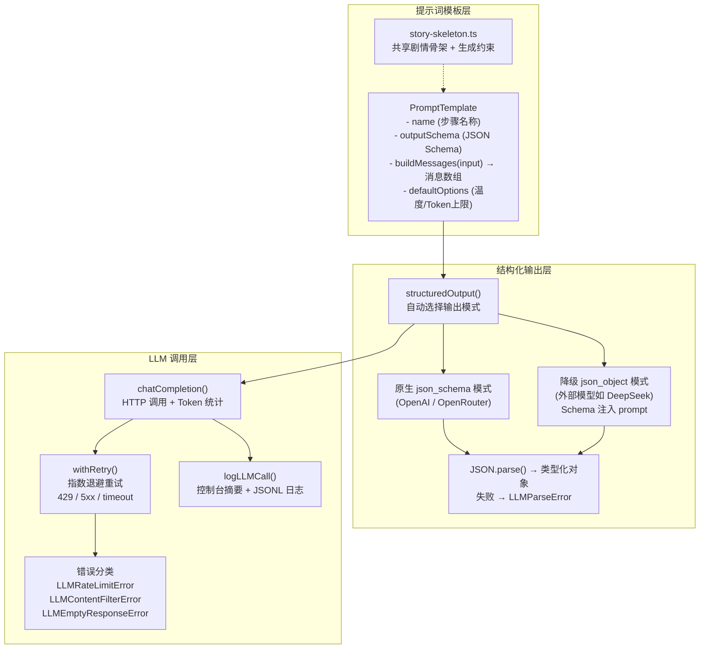

#### 8.4.3 探索工作流的逐步生成与校验机制

探索内容生成是整个 AI 工作流中最复杂的部分，采用 4 步串行流水线 + 第 5 步跨步校验的结构。每一步都遵循"生成 → 校验 → 传递"的模式：

**Step 1 场景布局生成**：系统先用随机种子确定场景的五个维度（住所类型、居住者身份、居住方式、生计痕迹、空间主导区），然后将种子结果注入提示词，由 LLM 生成场景描述和 2-4 个区域。生成后校验场景 ID 格式、标题长度、描述充分性、区域数量范围和 ID 唯一性。

**Step 2 物品骨架生成**：接收 Step 1 的场景和区域数据，由 LLM 为每个区域生成物品列表，确定每个物品的类别（atmosphere / false_clue / true_clue / special）、是否携带线索、是否响应念珠、以及物品对应的推理线。生成后校验物品分布是否合理（各类别数量下限）、推理线覆盖是否完整（A-E 五条线）、念珠物品是否存在且唯一。

**Step 3 物品描述生成**：接收 Step 1-2 合并的骨架数据，由 LLM 为每个物品生成详细描述文本，以及为标记了念珠响应的物品生成残念文本。生成后校验每个物品是否都有对应描述、每个念珠响应物品是否都有残念文本。

**Step 4 线索映射生成**：接收骨架和描述数据，由 LLM 生成线索定义，建立线索与物品的映射关系、线索类型标注和是否可作为证据的标记。生成后校验线索总数下限、来源物品是否存在、线索类型是否合法。

**Step 5 跨步骤校验**：不调用 LLM，纯逻辑校验四步产出的数据之间的一致性。包括：每个标记为物证的物品是否确实关联了可用作证据的线索、每条念珠记忆类线索的来源物品是否确实有残念文本、各类别物品的最终数量是否满足要求、推理线在合并后数据中的覆盖是否完整。

这种"逐步校验 + 最终交叉校验"的机制，是本项目工作流设计的核心特点之一。它解决了一个关键问题：LLM 单步输出通常看起来没问题，但步骤之间容易出现不一致（比如物品骨架标记了"有线索"，但线索映射步骤却遗漏了对应条目）。通过在每一步后立即校验本步产出、在最后校验跨步一致性，问题可以被尽早发现并定位到具体步骤。

#### 8.4.3.1 为了让探索文本自然且符合逻辑，项目采用的方法

仅靠一次提示词直接让模型生成"场景 + 物品 + 描述 + 线索"，很容易出现两个问题：一是文本虽然好看，但逻辑不闭合；二是结构虽然完整，但文案生硬、像说明书。为了解决这两个问题，本项目同时从**工程拆分**和**提示词设计**两侧约束探索阶段文本。

**1. 先约束叙事骨架，再生成局部内容**

所有探索步骤共享同一份 `story-skeleton`，其中预先写死了世界背景、真实事件链、主角身份、白姑的叙事边界、不能揭示的真相范围，以及玩家在探索结束后应该形成的判断。这样做的作用是：每个步骤虽然都由 LLM 独立生成，但它们都围绕同一条故事主轴工作，不会一步写成"妖怪食人"，一步又写成"村民自相残杀"，避免叙事跑偏。

**2. 用物品分类保证场景既自然又有推理层次**

项目没有把所有物品都设计成"证据"，而是明确分成四类：

- `atmosphere`：纯氛围物，只负责建立屋子的生活感、空间感和压抑气氛
- `false_clue`：伪线索物，看起来可疑，能支持 NPC 的错误叙事
- `true_clue`：真线索物，承载真正帮助玩家拼出真相的证据
- `special`：残缺念珠，是玩法升级节点而不是普通线索物

这套分类非常重要。它让探索文本不会变成"每个物品都在大声讲真相"。场景中有些物品只是为了让这间屋子像真的有人住过，有些物品负责误导，有些物品负责揭示事实，文本层次因此更自然。

**3. 用线索类型把"郎中视角"落到具体观察方式上**

项目为线索定义了固定类型，而不是笼统地写成"发现了线索"。探索文本主要围绕以下类型组织：

- `pathology`：病理观察，例如异常发病、体征、伤情
- `pharmacology`：药理判断，例如药渣成分、药方配伍、用药方向
- `conflict_trace`：冲突痕迹，例如扭打、碰撞、拖拽、破坏
- `bead_memory`：念珠触发的残念片段
- `misc`：其他辅助推理的信息

这意味着主角不是在像侦探一样做全能推理，而是在像一个游方郎中一样观察现场。文本的"自然感"并不是来自华丽辞藻，而是来自角色观察方式本身就合理。

**4. 描述统一采用第二人称沉浸式独白，但保持郎中职业判断**

在物品描述提示词中，项目明确要求：

- 全部用第二人称"你"来写
- true_clue 物品必须写出**具体可观察事实**
- 描述层次遵循"表象信息 → 专业判断 → 疑点暗示"
- 语气要让人感觉是主角正在检查现场，而不是系统在介绍设定

这使得文本同时具备两种效果：读起来像玩家正在亲自摸索现场，又不会丢掉主角作为郎中的专业性。比如它不是泛泛地说"这里有点奇怪"，而是会落到"药渣里混有不该出现的成分""伤痕不像寻常跌倒所致"这种能支持后续推理的观察。

**5. 用推理线（A-E）约束每个物品到底承担什么叙事功能**

项目没有让模型自由决定"这个物品大概能说明什么"，而是先设计了 5 条核心推理线，再要求 Step 2 的物品骨架为物品分配 `evidenceLines`：

- A：死者死前状态异常 / 发病
- B：外来者与患者发生过激烈打斗
- C：有外来者来过现场
- D：有骨骼或物品被带走
- E：外来者行为并不像纯粹的攻击者

之后 Step 3 写描述、Step 4 生成线索时，都必须严格围绕这些推理线展开。这样每个物品不是"想到哪写到哪"，而是先有功能分工，再有具体文案，逻辑链更稳定。

**6. 用"承载家族 + 随机种子"控制变化范围，而不是完全随机**

项目虽然强调可重复游玩，但变化不是完全放任的。场景布局用 `sceneSeed` 决定住所框架、居住者身份、生计痕迹、空间重心；物品与推理线用 `clueSeed` 决定某条线更适合由哪类宿主物件来承载，例如：

- A 线更偏治疗物 / 身体体征物 / 被中断的诊治动作
- B 线更偏家具受力痕迹 / 挣扎位移痕迹 / 防御反击痕迹
- D 线更偏搬运路径 / 缺失痕迹 / 残留碎屑

模型可以在这些范围内创造具体物品，但不能偏离家族。这样既有变化，又不会生成出和场景身份完全无关的物品。

**7. 用伪线索和残念机制避免文本过于直白**

如果每个物品都直接写出"真相的一部分"，文本会失去悬疑感。本项目通过两种方式控制信息释放节奏：

- `false_clue` 让文本可以合理地支持误判，帮助形成"白姑可能有罪"的表象叙事
- `bead_memory` 让 E 线等关键内容通过主观、片段化、情绪化的残影呈现，而不是由直接证据平铺直叙地说出来

这使探索阶段既有"看见的证据"，也有"感到不对劲的印象"，文本更像悬疑叙事而不是清单式证据罗列。

**8. 用格式与内容双重约束，防止模型写成报告体或旁白体**

提示词中不仅规定"写什么"，还规定"怎么写"。例如：

- special 物品（残缺念珠）要突出神秘质感与轮回意味
- 残念文本禁止用括号说明、禁止用"残影出现："这类前缀
- 线索摘要要带有郎中的职业判断，但不能跳到全局真相
- 明确禁止直接说出玩家尚未知晓的骨架真相

这些约束的作用，是避免模型生成出"法医报告式摘要"、"系统说明书式文案"或"上帝视角剧透"。

**9. 工程上拆成 骨架 → 描述 → 线索，而不是一步生成成品**

工程拆分本身也是保证自然性和逻辑性的关键方法：

- Step 2 先解决"这个屋里有什么、它们分别承担什么功能"
- Step 3 再解决"这些东西在主角眼里具体是什么样"
- Step 4 最后才把描述提炼成可用于辩论的线索

这种顺序很像人工设计流程：先布置现场，再写观察，再总结证据。相比一步到位生成最终文本，它更接近真实创作过程，因此更容易得到既自然又可推理的内容。

可以把这一整套方法概括为一句话：**先用工程结构规定内容关系，再用提示词细化叙述语气和角色视角**。前者保证逻辑闭合，后者保证文本自然。

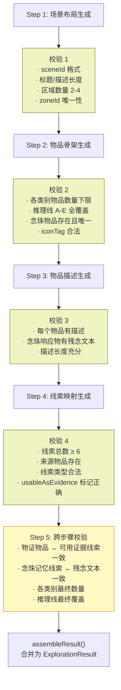

#### 8.4.4 辩论工作流的生成与校验

辩论工作流分为两个层面：一是进入辩论阶段前的**初始化生成**，二是辩论进行中的**追问 / 出示证据 / 态度推进**。它不是把 NPC 当作一个自由聊天机器人，而是把"人物设定、错误前提、可反驳关系、状态推进"都先设计好，再让 LLM 在这些边界内说话。

初始化阶段仍然遵循"生成 → 校验"模式。LLM 基于探索结果生成 NPC 角色设定、3 条错误观点和开场话术后，校验逻辑会检查：

- 观点数量是否恰好为 3 条
- 每条观点是否关联了至少 1 个可驳倒的线索 ID
- 关联的线索 ID 是否确实存在于探索阶段的线索表中
- 关联的线索是否标记为可用作证据
- 是否至少有 1 条观点的论据来自伪线索
- 开场话术长度是否充分

这套校验确保了辩论系统能正确衔接探索阶段的产出，避免出现"线索对不上观点"的断裂。

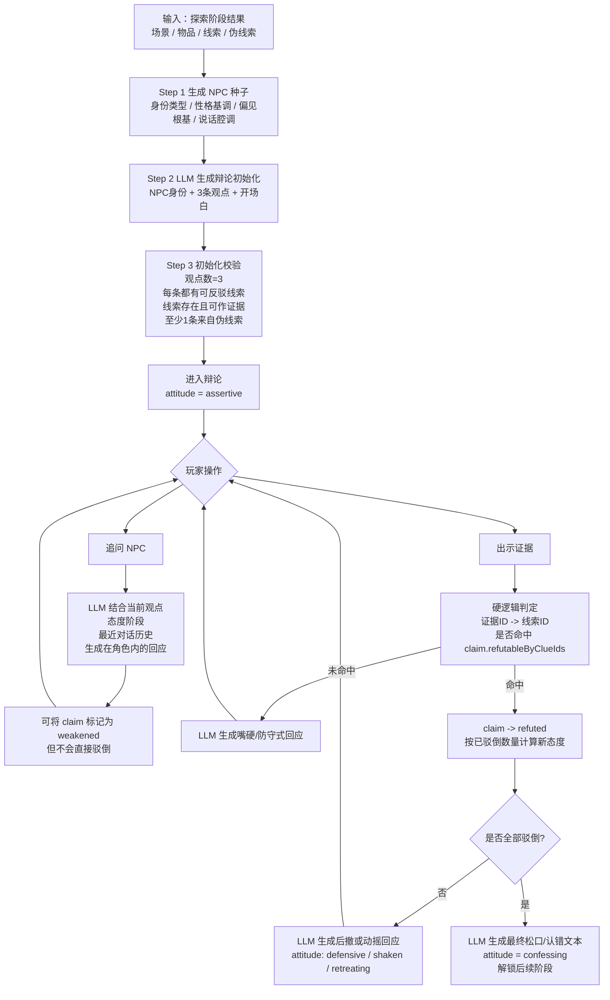

##### 8.4.4.1 为了让 NPC 的对话自然且有逻辑，项目采用的方法

**1. 先把 NPC 的"人"定下来，再让它开口**

项目没有直接让模型凭空生成一个会说话的村民，而是先用 `npcSeed` 将 NPC 固定在 4 个维度上：

- 身份类型：如宗族长辈、村务管事、技艺领头、庙祝/神婆、商事人物
- 性格基调：如暴躁冲动、阴沉多疑、倚老卖老、精明世故、胆小逞强
- 偏见根基：如亲历创伤、迷信传说、维护权威、恐惧投射
- 说话腔调：如粗犷直白、绵里藏针、煽动裹挟、故弄玄虚、碎碎念

这样做的效果是，NPC 的发言不会一会儿像族老、一会儿又像猎户，也不会上一句阴沉多疑、下一句突然变成滑头商人。它先是一个具体的人，再是一个输出文本的角色。

**2. 用"错误前提"而不是用"现象描述"来组织观点**

辩论里最核心的设计，不是让 NPC 重复现场现象，而是要求它的每条观点都建立在一个**可被证据否定的错误前提**上。例如不是说"屋里有打斗痕迹"，而是说"这些痕迹说明白姑单方面行凶"。这样玩家出示证据时，驳倒的是推断逻辑，而不是在和 NPC 重复同一件事。

这一步很关键，它让对话有真正的论辩关系，而不是"NPC 说一句表象，玩家也说一句表象"。因此辩论读起来才像争执和推翻，而不是信息复读。

**3. 观点和证据之间采用硬约束映射，避免胡编乱接**

每条观点都必须带有 `refutableByClueIds`，只能引用探索阶段已经生成、并且 `usableAsEvidence=true` 的线索。后续玩家出示证据时，系统会先做硬逻辑判断：

- 先把玩家提交的 `evidenceId` 解析成实际线索 ID
- 再检查该线索是否命中目标观点的 `refutableByClueIds`
- 命中才允许观点进入 `refuted`
- 未命中则只能触发 NPC 的防守式回应

也就是说，"这条证据能不能驳倒这句话"不是让 LLM 自己临场发挥决定的，而是由结构化数据先行判定。LLM 负责把结果说得自然，逻辑正确性由系统兜底。

**4. 用探索阶段的真实物证，限制 NPC 只能在已有信息上犯错**

NPC 的观点不是脱离上下文瞎编的，而是建立在探索阶段已经出现的物品、线索、伪线索之上。特别是项目要求至少 1 条观点来自 `false_clue`，这使得 NPC 的错误不是"无中生有"，而是"基于表面证据得出的错误归因"。

这会让 NPC 的偏见显得更真实。因为现实中的人也往往不是胡说八道，而是抓住一点看似有理的东西，就把它解释成自己更愿意相信的结论。

**5. 区分"追问"和"出示证据"两类交互，避免一句话就把 NPC 说服**

项目把辩论中的玩家行为拆成两种：

- `question`：追问，只能让 NPC 回应、解释、嘴硬，最多把某条观点打成 `weakened`
- `evidence`：出示证据，只有命中对应可反驳线索时，才能真正把观点打成 `refuted`

这个设计非常重要。它避免了大模型式对话常见的问题：只要玩家说得像样一点，NPC 就突然被说服。这里真正能改变辩论状态的是证据，而不是话术，因此逻辑更稳。

**6. 用态度阶段控制 NPC 的说话变化，而不是每轮都重置口吻**

NPC 在辩论中有明确的态度递进：`assertive → defensive → shaken → retreating → confessing`。项目根据已驳倒观点数量计算当前态度阶段，再把这个阶段传给后续提示词。

这意味着 NPC 的语言会随着局势变化而变化：

- 一开始更强硬、更笃定
- 被驳倒一条后开始防守和补锅
- 证据越来越多时出现动摇和后撤
- 全部观点被推翻后才进入真正的松口或认错

这种状态机让对话具备连续性。NPC 不会上一轮还在嘴硬，下一轮毫无铺垫就突然彻底认输。

**7. recentHistory 让 NPC 记住自己刚说过什么**

无论是追问回应、证据命中后的后撤回应，还是最终松口文本，提示词都会注入最近几轮对话历史。这样模型生成新一轮发言时，能够参考前文已经说过的内容，减少自相矛盾、重复发言或忘记自己立场的情况。

所以这里的"自然"不仅是文风自然，也是会话连续性自然。

**8. 让 LLM 负责"表达"，让系统负责"判定"**

辩论工作流里最值得强调的一点，是它采用了明显的混合式设计：

- 系统负责：观点数量、证据命中关系、状态流转、态度计算、是否解锁后续阶段
- LLM 负责：NPC 的具体台词、情绪表达、嘴硬方式、后撤语气、最终松口措辞

这种分工比完全交给模型自由对话更可靠。因为"逻辑是否成立"由程序规则控制，"台词是否像一个活人"交给 LLM 发挥，两者结合后，NPC 才能既像在说人话，又不至于把辩论写崩。

**9. 开场白、观点、后撤文本都围绕同一个角色核生成**

从初始化时的开场白，到中途追问/反驳时的应答，再到最后的 confession，提示词始终使用同一个 NPC 名字、身份、语气、态度阶段和历史上下文。也就是说，项目不是每轮都重新生成一个"临时 NPC"，而是在持续扮演同一个人。

这也是辩论对话自然的重要原因之一：玩家感受到的是一个持续存在、逐步被逼退的人，而不是每一轮都换了一个说话者。

从游戏设计的角度看，这套辩论系统也比纯聊天式 NPC 更适合作为玩法机制。纯聊天虽然自由，但很容易变成"谁更会说话谁就赢"，结果不稳定，也难以形成明确的关卡目标；而本项目的辩论把自由表达建立在证据映射、错误前提、状态推进和可验证规则之上，玩家需要真正理解探索阶段获得的信息，才能有节奏地追问、试探、出示证据并逐步瓦解对方立场。这样一来，辩论就不只是"和 AI 聊天"，而是一种可推理、可失败、可通关的交互玩法。

#### 8.4.5 工作流特点总结

| 特点 | 说明 |
|------|------|
| 共享叙事骨架 | 所有生成步骤共享同一份剧情骨架和约束，保证跨步骤内容一致性 |
| 结构化输出 | 每步都通过 JSON Schema 约束输出格式，避免自由文本解析问题 |
| 逐步校验 | 每步生成后立即执行本步校验，问题不累积到最后 |
| 跨步交叉校验 | 最终阶段检查各步产出之间的逻辑一致性 |
| 随机种子驱动 | 场景生成由随机种子决定五个维度，保证可重复游玩的变化性 |
| 上下文链式传递 | 每步的输出作为下一步的输入上下文，形成递进式细化 |
| 自动重试 | 瞬态错误自动指数退避重试，不因单次调用失败中断全流程 |
| 全量日志 | 每次 LLM 调用记录模型、耗时、Token、结果，便于调试和成本分析 |

### 8.5 会话与调试

后端在探索初始化时创建内存会话，辩论初始化时将辩论数据追加到同一会话中。会话保存探索结果、辩论初始化数据、图像结果、辩论历史、工作流日志和中间结果。开发时可以通过调试接口查看最近一次生成的完整数据，有助于快速定位问题。

## 9. 关键难点与解决方式

虽然当前原型已经能够跑通一整套"开场 → 探索 → 辩论 → 结尾"的完整体验，但在真正把 AI 工作流落成可玩的游戏机制时，仍有两个必须正视的问题：一是**时间成本控制**，因为文本生成、辩论初始化、场景图、物品图标和 NPC 立绘叠加在一起后，请求链条会很长，玩家很容易在等待中出戏；二是**生成随机性的真实性**，因为当提示词和结构约束越来越多时，LLM 会倾向于回到高概率、熟悉、稳定的答案，表面上看似"可选项很多"，实际运行中却容易反复落到某几个固定模板上。如果不处理这两个问题，项目就会陷入一个典型困境：一方面 AI 成本高、等待长，另一方面动态生成又不够"动态"，最终削弱 AI 原生叙事玩法最重要的价值。

### 9.1 如何让 AI 生成结果不跑偏

完全放开生成容易导致剧情越界、线索失真或风格混乱。为此，项目使用共享故事骨架与生成约束，对世界观、真实事件链、文本风格、主角视角和不能揭示的内容进行明确限制。

### 9.2 如何让探索与辩论真正联动

如果探索阶段获得的信息无法进入辩论系统，玩家会觉得前后割裂。项目通过线索定义、可驳倒观点映射和会话态保存，把探索产出的线索直接带入辩论判断逻辑中，让调查成果真正影响后续互动。

### 9.3 如何兼顾随机性与可验证性

随机生成会增加可玩性，但仅仅把"随机"交给 LLM 并不可靠。实际测试中可以发现：当提示词中同时要求世界观一致、事件链一致、物品分类完整、推理线覆盖齐全、文本风格统一时，模型虽然能稳定产出"合格结果"，却也会更倾向于选择它最熟悉的那几个高概率选项，例如固定偏好某类住户、某类线索宿主或某类 NPC 形象。这会让结果看起来始终合理，却逐渐失去重复游玩时应有的新鲜感。

为了解决这个问题，项目没有继续通过"把温度调高一点"或"再给模型更多可选项"来追求表面随机，而是把一部分随机性前移到代码硬逻辑中实现。具体来说：

- 场景布局阶段先由 `sceneSeed` 随机决定 5 个维度：住所框架、居住者身份、居住方式、生计痕迹、空间主导区
- 物品骨架阶段先由 `clueSeed` 随机决定 A-E 五条推理线分别落在哪一类承载家族上
- 辩论初始化阶段先由 `npcSeed` 随机决定 NPC 的身份类型、性格基调、偏见根基和说话腔调

在实现上，这三类 seed 的做法是一致的：代码先随机生成一段由字母和数字组成的短串，再把短串的每一位映射到预先设计好的范围标签。三类 seed 的完整维度和可选项如下：

#### sceneSeed — 场景布局种子（5 位，格式：字母-字母-数字-数字-字母）

| 位 | 维度 | 可选项 |
|:---:|------|--------|
| 第 1 位 | 住所框架 | 标准民居 / 兼作营生空间的住处（前铺后居、作坊兼住） / 临时改造或公共空间被人住用 / 废弃建筑再利用 / 宗教守望过路性质兼住（破庙、山神小庙） |
| 第 2 位 | 居住者身份 | 山野谋生者（猎户、采药人、烧炭工） / 水边谋生者（渔者、摆渡人） / 行走流动者（货郎、脚夫） / 村中职能人物（村长、族老、守庙人） / 边缘生存者 / 残缺家庭 / 躲藏暂避身份模糊者 |
| 第 3 位 | 居住方式 | 正常长期居住 / 单人独住 / 家庭居住但已残缺 / 不是家，暂住借住或看守职能兼住 |
| 第 4 位 | 生计痕迹 | 劳作型 / 交易型 / 修补凑合型 / 清贫寥落型 / 囤积杂乱型 / 看似闲散实则另有用途型 |
| 第 5 位 | 空间主导区 | 灶台 / 卧榻 / 供桌香案 / 储柜箱笼 / 劳作台 / 腌缸坛瓮角 / 水缸洗涤角 / 晾架悬梁下 |

#### clueSeed — 线索承载种子（5 位，格式：字母-字母-数字-数字-字母）

| 位 | 维度 | 可选项 |
|:---:|------|--------|
| 第 1 位 | A 线（死者发病）承载家族 | 治疗物（药碗、药包、残方） / 身体体征物（污布、抓痕褥席、齿痕木片） / 被中断的诊治动作（翻开的医书、半磨的药末） |
| 第 2 位 | B 线（激烈打斗）承载家族 | 家具受力痕迹（撞痕、裂角、翻倒） / 挣扎位移痕迹（拖拽褥席、歪斜板凳） / 防御反击痕迹（被抓起又丢开的工具） / 打击结果痕迹（木屑、碎陶、擦血） |
| 第 3 位 | C 线（外来者来过）承载家族 | 入口异常（门槛、窗台、门闩） / 外来材质（纤维、灰粉、皮屑） / 借道痕迹（踩踏、攀附） / 停留痕迹（搁放、扶按、轻触） |
| 第 4 位 | D 线（有东西被带走）承载家族 | 搬运路径（拖痕、负重擦痕） / 缺失痕迹（被掏空的箱格、空出的墙钩） / 残留碎屑（骨粉、碎片、捆绑残线） / 二次整理痕迹（翻动、挪开、再摆回） |
| 第 5 位 | E 线（非攻击行为）承载家族 | 照护动作（垫高、扶正、掩盖） / 迟疑动作（手伸到一半又缩回） / 悲悯动作（收拾散落遗物、把伤者摆正） / 克制动作（绕开、小心搬动、避免惊扰） |

#### npcSeed — NPC 角色种子（4 位，格式：字母-字母-数字-数字）

| 位 | 维度 | 可选项 |
|:---:|------|--------|
| 第 1 位 | 身份类型 | 宗族长辈（族老、长房家主） / 村务管事（里正、保甲长） / 技艺领头（猎户头子、铁匠头、烧炭把头） / 信仰玄学人物（庙祝、看香婆、风水先生） / 经济商事人物（粮栈掌柜、山货收购商） |
| 第 2 位 | 性格基调 | 暴躁冲动 / 阴沉多疑 / 倚老卖老 / 精明世故 / 胆小逞强 |
| 第 3 位 | 偏见根基 | 亲历创伤（至亲曾遭遇相关事件） / 传说信徒（深信祖辈口传故事） / 利益地位驱动（需要替罪羊维护权威） / 恐惧投射（极度害怕未知，需要确定的"敌人"） |
| 第 4 位 | 说话腔调 | 粗犷直白 / 绵里藏针 / 煽动裹挟 / 故弄玄虚 / 碎碎念型 |

每个 seed 的各维度组合是独立的，理论可选组合数量分别为：`sceneSeed` 5×7×4×6×8 = 6720 种，`clueSeed` 3×4×4×4×4 = 768 种，`npcSeed` 5×5×4×5 = 500 种。

得到映射结果之后，系统并不是把它们藏在后端内部，而是直接把这些"本次已确定设定"写进对应步骤的 prompt 中，并明确告诉模型"必须严格遵循，不可更改"。也就是说，随机性并不是作为模型的自由发挥空间存在，而是作为本轮生成的硬前提存在。模型负责在这个前提下把内容具体化，例如把"山野谋生者"具体化成烧炭工或采药人，把"迟疑动作"具体化成某种残念片段，把"宗族长辈 + 精明世故 + 粗犷直白"具体化成某种村中权威人物的说话方式。

这种实现还有一个额外好处：由于 seed 映射结果本身是清晰可见的，开发时可以直接从日志中看到本轮到底随机到了哪些维度，从而更容易分析"为什么这次会生成成这样"，也便于在测试中观察 LLM 的选择偏好是否真的被拉开了。换句话说，随机性不再是黑盒里的偶然波动，而是可以被记录、解释和复查的结构化输入。

这些种子都不是让模型自己"想一个不一样的"，而是先由代码生成随机串，再通过映射表把每个字符映射到一个明确范围标签，最后把映射结果写进 prompt，要求模型在这个范围内具体化。这种做法的好处是：**随机性是先被程序稳定地产生出来，再交给 LLM 去做受约束的细化创作**。于是，变化不再依赖模型当场有没有临时想出新点子，而是由系统先决定本轮必须变化的维度，模型只负责把这个变化落成自然文本。

这种方案比其他看似直接的方法更适合本项目。单纯提高 temperature 或放松提示词，确实可能带来更多表面差异，但也更容易让内容偏离剧情骨架、破坏线索覆盖关系，甚至导致后续校验失败；而如果完全依赖手工预设多个完整模板，再随机抽取，虽然稳定，却会迅速把动态生成退化成"模板换皮"，失去 AI 原生内容生成的意义。相比之下，随机串映射的方法在"可验证"和"有变化"之间取得了更平衡的结果：变化由代码保证，细节由模型补足，最终既方便校验，也更有重复游玩的价值。

### 9.4 如何缩短玩家等待时间

本项目最耗时的部分并不是单次文本补全，而是"一整幕资源一起生成"时产生的链式等待：探索工作流本身要经过多步文本生成，之后还要补场景图、多个物品图标，以及辩论阶段所需的初始化文本和 NPC 立绘。尤其是在探索阶段，物品图标数量多、生成成本高，如果仍按一次性全部生成的方式处理，玩家会在真正开始操作前等待很久，这对于叙事探索类游戏来说是非常伤节奏的。

针对这个问题，项目采用了几层叠加的优化策略。

第一层是**调整调用时机**。在整体方案上，生成请求被拆成两阶段按需触发：开始游戏时尽早发起探索阶段必需资源的请求；进入探索后，再继续发起辩论初始化和 NPC 立绘请求。这样做的核心原则不是"把总耗时变短"，而是把等待分摊进玩家已有的流程里，并保证每个阶段只生成当前阶段真正需要的数据，避免把后续资源的等待强行叠加到第一屏。

具体实现思路上，这种"两阶段触发"并不是简单把原来的大请求拆成两个名字不同的接口，而是按资源依赖关系来切分：第一阶段只负责探索所需的文本工作流、场景图和物品图标，保证玩家能尽早进入可操作的探索状态；第二阶段才补辩论初始化和 NPC 立绘，因为这些内容在玩家刚进入游戏时并不会立刻使用。这样切分之后，请求会在玩家操作链条上更早开始，但每个阶段承担的任务更少，首屏等待也更短。

第二层是**阶段内并行**。在当前后端实现中，即使仍存在一个总初始化入口，也已经将场景图、物品图标和 NPC 立绘放进 `Promise.allSettled()` 并行处理，而不是串行等待全部完成；同时服务端会监听客户端断开，在关键节点尽早停止后续生成，减少无效消耗。也就是说，本项目并不是简单减少内容，而是在"不砍内容"的前提下，让能并行的工作尽量并行，让已经没有意义的工作尽量停止。

它的实现方式是：文本工作流先产出结构化探索结果，随后后端把场景图生成、物品图标生成、NPC 立绘生成分别封装成独立任务，再统一交给 `Promise.allSettled()`。这样即使某一路图像生成失败，也不会拖垮整个初始化流程，其他资源依然可以回填并继续返回给前端。与此同时，路由层会监听客户端连接状态，一旦用户中途离开或取消，本次请求会在下一个检查点直接终止，避免继续消耗文本或图像模型额度。

第三层是**基于 iconTag 的图标资源库复用机制**。这里并没有把复用逻辑直接绑定到 itemId 或完整物品名称，而是设计了一套以 `iconTag` 为主键的图标资源库，由标签注册表和图标资源表共同组成，统一存储在数据库中：

- 物品骨架生成时，prompt 中注入当前数据库中已有的全部 `iconTag` 列表，引导 LLM 优先复用已有标签
- 若 LLM 生成了新的合法标签，在校验阶段自动写入数据库的标签注册表，后续所有运行都能查到
- 图标生成阶段以 `iconTag` 为检索键查询图标资源表
- 同一批次内若多个物品共享同一个 `iconTag`，直接复用内存中的结果
- 跨批次、跨轮次时，若数据库中已有该 `iconTag` 对应的图标资源，则直接复用，不再调用图像模型

在实现上，"怎么把已有 iconTag 告诉 LLM"这个问题的回答是：每次进入物品骨架生成步骤时，系统先向数据库发起一次查询，拉取标签注册表中的全部 `iconTag`，拼成一份列表注入到 prompt 里，要求模型优先从中选取、必要时才创建新标签。这和之前从文件读取并无本质区别，只是数据源从本地 JSON 文件变成了数据库查询，但好处在于：多个服务实例可以共享同一份标签库，且标签的增长在部署层面是可见、可管理、可备份的。

随后在物品骨架校验阶段，系统会检查每个 `iconTag` 是否格式合法；如果是新标签但格式正确，就写入数据库的标签注册表。也就是说，标签的增长不是人工维护词表，而是生成流程运行过程中自动完成的。

到了图标生成阶段，系统先看同一批次里有没有别的物品已经使用过相同的 `iconTag`，如果有就直接复用内存中的结果；如果没有，再向数据库查询是否已存在该 `iconTag` 对应的图标资源；只有批内复用和数据库查询都未命中时，才真正调用图像模型生成新图。生成完成后，结果会再经过一次背景去除处理，并以 `iconTag` 为主键写入图标资源表。这样一来，`iconTag` 同时承担了"提示词词表条目"、"标签注册表主键"和"图标资源表检索键"三种角色，整个复用链条是闭合的。

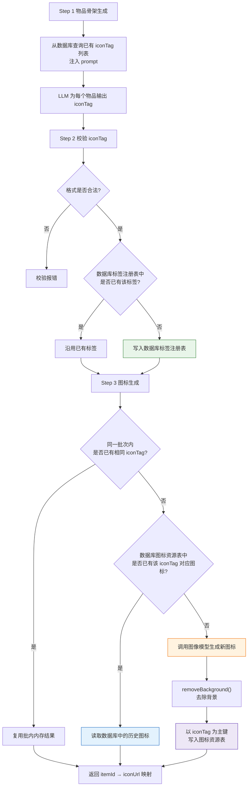

这种设计的价值在于，它把"视觉语义"和"单次物品实例"分开了。多个物品即使名字不同，只要本质上属于同一视觉类别，就可以复用同一张图标；同时，新标签又可以在后续运行中逐渐积累，使图标语义空间越来越丰富，而不是每次都从零开始。换句话说，`iconTag` 既是图标资源库的检索键，也是图标语义词表的增长机制。

之所以选择 `iconTag` 作为检索键，而不是直接上 embedding 检索，首先是因为这个场景本质上并不需要"模糊语义相似度搜索"，而需要的是"稳定、可控、一对一的视觉类别归并"。如果改用 embedding，那么每次都要先为物品名称或描述计算向量，再做近邻匹配，系统复杂度、存储成本和调试成本都会明显上升；更重要的是，embedding 的相似结果往往是连续的、带阈值的，这对推荐系统是优点，但对图标复用却未必合适。图标复用更需要"这个物品到底该落到哪一类"的明确答案，而不是"它和哪些历史物品大概有点像"。使用 `iconTag` 后，归类结果会在物品骨架生成阶段被显式输出出来，后续校验、注册、缓存命中和资源复用都围绕同一个离散标签展开，整个链条更容易验证，也更容易排查问题。

它也比直接使用物品名称作为检索键更合适。物品名称天然带有叙事表达和局部上下文，同一种视觉物件在不同轮次里完全可能被命名成"药碗"、"裂口药盏"、"盛药粗陶碗"或"沾着药渍的小碗"；如果直接拿名称做键，系统会把这些本质上应当共用图标的物品误判成不同资源，导致缓存命中率很低。相反，`iconTag` 刻意把名称中的修辞、情绪和剧情细节剥离掉，只保留最适合图像复用的视觉语义，例如"medicine_bowl"、"paper_scroll" 这类更稳定的类别词。这样一来，上层文本仍然可以保持生成内容的自然性和变化感，底层资源复用却不会因为命名波动而失效。

从工程角度看，`iconTag` 还有一个额外优点：它同时服务于 prompt 约束、校验规则、数据库索引和图像资源复用，属于一种"同一字段贯穿全流程"的设计。也就是说，模型在生成阶段输出什么，校验层就检查什么，数据库就存什么，图标层就查什么，前后不会再出现"文本叫法是一套、缓存键又是另一套"的割裂。这种统一性对于当前项目尤其重要，因为它让 LLM 的开放生成和后端的硬逻辑复用之间，有了一个足够简单、足够稳定的接口层。

当前这套方案之所以适合本项目，是因为它保留了探索阶段"看见具体物件"的体验，而不是为了省时间直接砍掉图片数量、把所有物品都退化成纯文本列表。其他看似简单的办法，例如减少物品数量、完全放弃图标生成、或在进入游戏前一次性预生成所有可能资源，虽然也能减少等待，但要么会损失探索的视觉反馈，要么会把很多实际上用不到的资源也提前生成掉，进一步增加成本。相比之下，本项目选择的是更贴近玩法节奏的办法：**把请求尽早发起、把资源按阶段拆开、把相似图标尽量复用、把缓存从一次性优化变成可积累的系统能力**。这比单纯"削减生成量"更符合项目想要保留的 AI 原生体验。

## 10. 交互与界面呈现

项目整体 UI 采用"舞台式三栏布局"，左侧主要展示场景和人物形象，中间承载叙事文本与操作面板，右侧负责道具或证据展示。这样的布局使调查、观察、阅读和决策保持在同一视野中。

在文本呈现上，项目对开场、探索、辩论和结尾使用了不同的组件组合，但整体仍然强调统一的沉浸式阅读体验。特别是在探索与辩论中，玩家不是在看纯文本输出，而是在一个完整界面结构中接收 AI 生成内容。

从前端实现上看，这种"舞台感"并不是单纯依赖一套静态布局，而是通过固定设计稿尺寸 + 自适应缩放的方式实现的。前端将主舞台统一设定为 `1920×1080` 的逻辑画布，再根据当前视口等比缩放整个舞台，使不同屏幕下仍能保持相对稳定的构图关系。这样做的好处是：左侧场景图、中央文本框、右侧物品栏和底部进度条的位置关系是被整体控制的，界面更像一块被摆好的戏台，而不是普通网页中的松散区块。

开场阶段的交互也有一个比较值得一提的设计：**前端把剧情演出和后端初始化并行处理**。进入开场后，前端会一边播放固定的对话轮次，一边提前向后端请求本局所需数据；只有在玩家点完最后一句、且初始化已经完成之后，才真正进入探索阶段。如果初始化失败，界面会停留在当前舞台内显示错误信息和重试按钮，而不是直接跳回开始页。这种处理方式虽然简单，但很好地把"等待后端生成世界"这件事包进了演出流程里，减少了系统加载与叙事体验之间的割裂感。

探索阶段的前端交互组织也比较清晰。玩家不是一上来就面对一整屏散乱物品，而是先在中央区域选择"调查哪个方位"，再进入该区域的物品网格，最后查看单个物品详情，形成了"区域 → 物品 → 细节"的三层推进关系。与此同时，左侧始终保留场景图，右侧逐步累积已经发现且可作为证据的物品图标，悬停时还会直接显示该物品对应的线索摘要。这使探索过程既保留了空间感，也把"调查结果正在转化为后续辩论资源"这一点可视化了出来。念珠机制在前端上也有专门的显隐与激活状态：只有找到念珠后技能位才出现，只有查看可感应物品时才高亮，触发后的残念文本则作为单独演出插入流程中，而不是和普通物品说明混在一起。

辩论阶段的界面则把"对话"做成了一个带状态推进的操作面板，而不是自由聊天框。中央面板上方是 NPC 当前发言，下方是当前争议点、论据和玩家可执行操作；右侧证据栏沿用了探索阶段已经收集的物品图标，降低了阶段切换后的认知成本。NPC 发言会以打字流式出现，只有当前一句播完后，玩家才能继续追问或出示物证；每次成功驳倒观点后，焦点会自动切到下一条尚未驳倒的主张，顶部还会通过态度标签和底部的进度条显示辩论推进情况。也就是说，这套前端并没有把辩论做成"你一句我一句"的松散聊天，而是把它落成了一个可观察、可操作、可推进的博弈界面。

从状态管理上看，前端使用 Zustand 将 `phase`、`exploration`、`bead`、`clue`、`debate` 等状态拆成多个 slice 管理，既能支撑跨阶段的数据延续，也方便把每种交互的副作用放在对应切片中处理。例如，查看物品时会自动更新 `isDiscovered`、`isExamined`、线索收集状态和念珠激活状态；进入辩论时则会把 NPC、观点列表、当前焦点观点和历史记录整体写入状态树。这样的拆分方式使界面交互不是由单一大组件硬撑，而是围绕"阶段状态如何变化"来组织，比较符合这种多阶段叙事玩法的前端实现方式。

## 11. 开发流程与模块化思路

从当前代码结构来看，项目在实现上采用了较清晰的分层策略：

- 前端按阶段拆分页面与组件
- 状态管理按 phase、exploration、bead、clue、debate 等切片组织
- 后端按路由、会话、LLM 封装、提示词、工作流模块划分
- 探索与辩论分别拥有独立的工作流与测试脚本

这种模块化方式使项目既便于继续扩展，也便于单独调试某一部分，例如只检查探索工作流、只检查辩论逻辑，或单独验证图像生成流程。

## 12. 当前成果

截至目前，项目已经完成了一个较完整的单幕原型，具备以下成果：

- 已完成前端主流程页面切换与核心交互
- 已完成探索内容生成工作流
- 已完成辩论初始化与交互处理流程
- 已完成场景图、图标、NPC 立绘的生成接入
- 已实现基于会话的调试与中间结果查看
- 已提供探索与辩论工作流的测试脚本

从原型验证的角度看，项目已经证明了一件重要的事：AI 不只是可用于"写一点文案"，而是可以参与搭建一个从叙事骨架、调查内容、辩论逻辑到视觉资源都可动态生成的游戏原型系统。

## 13. 项目价值与能力体现

这个项目体现的能力，不只是前端或后端实现本身，而是"游戏策划 + AI 系统落地"的综合能力：

- 能将抽象的故事概念转化为结构化的玩法流程
- 能为 AI 输出建立边界、约束和可验证机制
- 能把探索、线索、辩论和叙事组织成闭环体验
- 能将文本生成与图像生成共同纳入统一产品流程
- 能为 AI 工作流保留调试口径，而不是停留在黑盒调用层面

如果把它作为作品集项目，它最有说服力的地方在于：它展示的不是"我做了一个带 AI 的游戏界面"，而是"我尝试搭建一套 AI 参与游戏内容生产和玩法推进的原型系统"。

## 14. 不足与后续优化方向

从目前实现状态来看，项目仍然属于原型验证阶段，后续可以继续完善的方向包括：

- 扩展更多幕次或更完整的世界观推进
- 强化探索阶段的分支反馈和多轮互动
- 进一步优化生成质量稳定性与生成耗时
- 增加更系统的自动化测试与异常回退策略
- 提升视觉资源风格一致性与前端演出表现
- 将当前以内存为主的会话机制升级为更稳定的持久化方案

## 15. 总结

总体而言，这个项目的核心意义不在于完成了一个大型商业游戏，而在于验证了一种方向：在叙事推理类产品中，AI 可以不再只是外挂式对话接口，而是成为场景、物品、线索、角色、辩论和视觉资产的共同生产者。

1. **从项目设计与开发角度看**，它是一个以中国山村志怪悬疑为题材的 AI 原生叙事推理游戏原型，围绕"固定叙事骨架 + AI 动态生成内容 + 玩家调查与辩驳"展开。项目想验证的并不是"能不能让模型写一段故事"，而是能不能把 AI 真的嵌入到游戏的可玩结构里：后端先用固定事件链、推理线、物品分类、角色约束把故事骨架立住，再把场景布局、物品骨架、物品描述、线索定义、辩论观点和图像资源拆成多个可校验步骤交给模型生成；前端则把这些结果组织成开场、探索、辩论、结尾四个连续阶段，让玩家通过调查区域、查看物品、触发残念、出示物证和驳倒观点来推进剧情。换句话说，这个项目真正完成的，不只是一个"带 AI 的界面"，而是一套把策划约束、提示词设计、工作流编排、状态管理、图像生成和调试机制串成闭环的原型系统。它说明 AI 在这里不是附加功能，而是直接参与了剧情组织、探索内容生产、物证推理结构和美术资产生成的核心流程。

2. **从故事背景与叙事设计角度看**，项目并不是凭空写一个山村怪谈，而是建立在对《西游记》与佛教轮回观念的重新解读之上。作品以金蝉子十世轮回为灵感起点，抓住原著中"九世殒命"这处留白，将其改写为一个围绕"轮回、业力、死亡与觉悟"展开的多世叙事框架。当前原型只是第一世第一幕，但它背后对应的是一个更大的主线设定：前八世将与八正道修行体系相对应，玩家会以不同凡人身份一次次入世，在樵夫、郎中、国师弟子、护经僧等不同人生中积累对世界、众生与自我的理解；每一世都会失败、死亡、重来，但这种重复不是简单重置，而是螺旋式推进的叙事结构。也就是说，项目在叙事上并不只追求"每一局都有点不同"，而是试图把多周目、AI 随机生成和佛教修行主题结合起来：表层是中国山村志怪悬疑，深层讨论的却是宿命是否能被超越、修行是否能在一次次失败中完成。这样的设计使原型虽然只展示了单幕，但已经能看出更长主线中的世界观方向、角色改编思路和哲学主题。

项目当前已经形成了较完整的原型闭环，也为后续继续扩展为更复杂的 AI 原生叙事游戏提供了扎实的结构基础。

---

## 附录：技术架构图示

### A1. 整体前后端架构

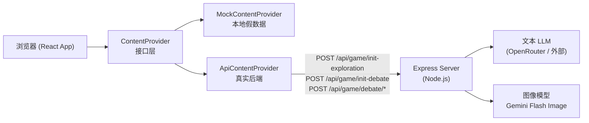

---

### A2. 前端页面流转与两阶段加载

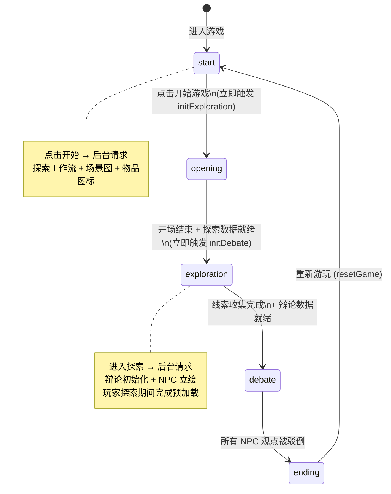

前端状态按切片组织，由 Zustand 统一管理：

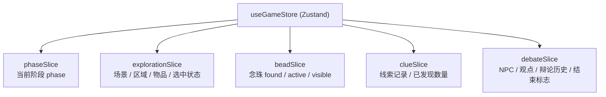

---

### A3. 内容提供层抽象 (ContentProvider)

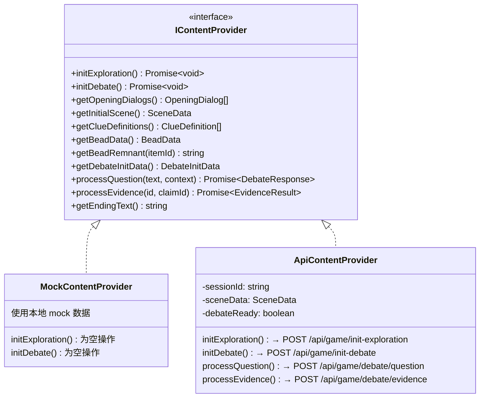

> 通过 `VITE_USE_REAL_API=true` 环境变量切换两种实现，前端代码无需改动。

---

### A4a. 探索初始化流程 (POST /api/game/init-exploration)

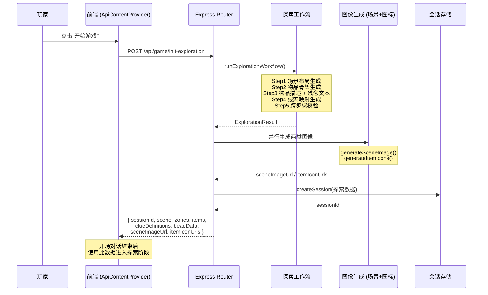

---

### A4b. 辩论初始化流程 (POST /api/game/init-debate)

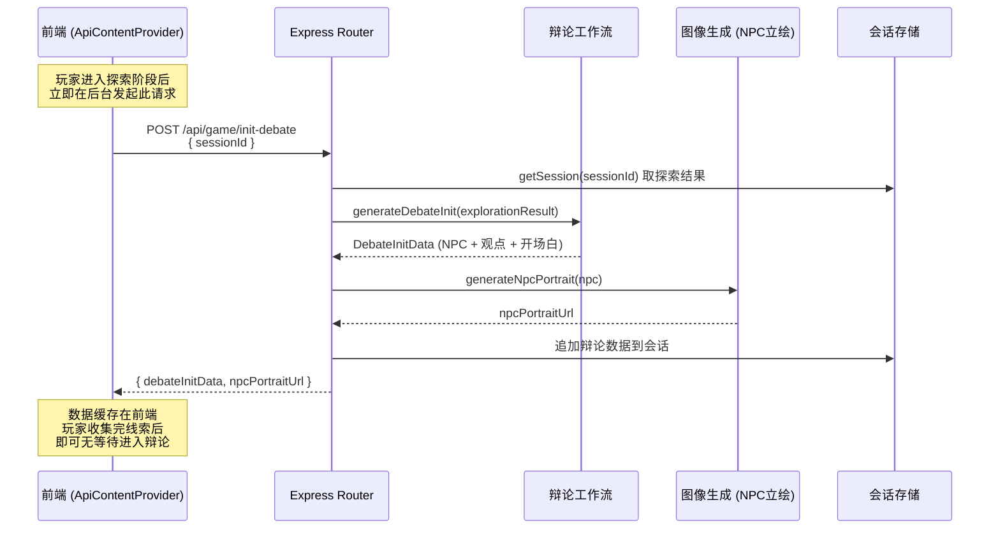

---

### A5. 辩论交互流程

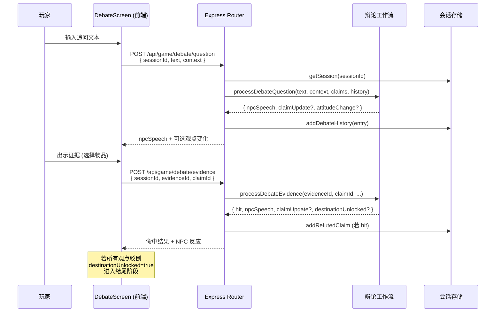

---

### A6. 探索内容工作流（4步流水线 + 逐步校验）

> 详细的逐步校验规则说明见正文 §8.4.3，此处为简化总览。

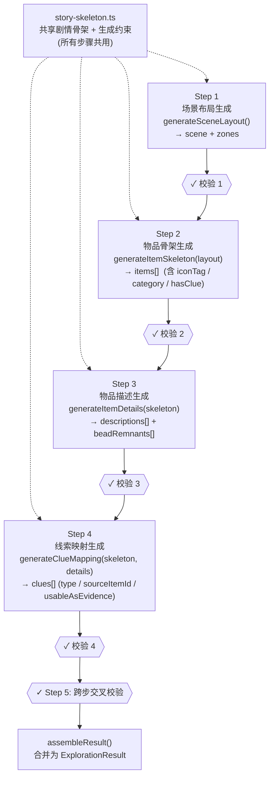

---

### A7. 图像生成与缓存策略（两阶段拆分）

```mermaid
flowchart LR
    subgraph 第一阶段：探索初始化时
        INIT1["POST /api/game/\ninit-exploration"]
        SG["generateSceneImage()\n1:1 像素等轴场景图\n→ dataUrl + backgroundColor"]
        IG["generateItemIcons(items[])\n0.5K 像素物品图标\n→ Map＜itemId, dataUrl＞"]
        INIT1 --> SG
        INIT1 --> IG
    end

    subgraph 第二阶段：辩论初始化时
        INIT2["POST /api/game/\ninit-debate"]
        PG["generateNpcPortrait(npc)\n3:4 像素 NPC 立绘\n→ dataUrl"]
        INIT2 --> PG
    end

    subgraph 图标资源库（数据库）
        CK["iconTag 检索键"]
        DB["icon_assets 表\nPK: icon_tag\nimage: BLOB / URL"]
        BG["removeBackground()\nmagenta chromakey 去背"]
    end

    IG --> CK
    CK -- "命中" --> DB
    CK -- "未命中" --> BG
    BG --> DB

    SG -- "提取角点像素" --> BC["backgroundColor\n(前端舞台背景色)"]
```
